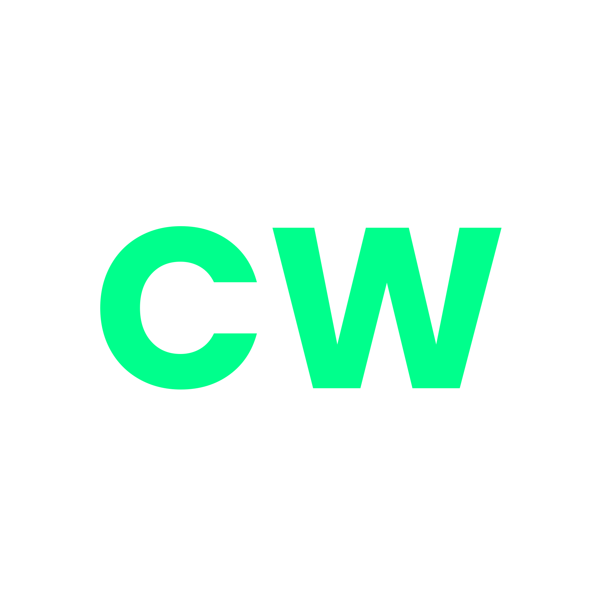

<!-- Improved compatibility of back to top link: See: https://github.com/othneildrew/Best-README-Template/pull/73 -->

<!--
*** Thanks for checking out the Best-README-Template. If you have a suggestion
*** that would make this better, please fork the repo and create a pull request
*** or simply open an issue with the tag "enhancement".
*** Don't forget to give the project a star!
*** Thanks again! Now go create something AMAZING! :D
-->

<!-- PROJECT SHIELDS -->
<!--
*** I'm using markdown "reference style" links for readability.
*** Reference links are enclosed in brackets [ ] instead of parentheses ( ).
*** See the bottom of this document for the declaration of the reference variables
*** for contributors-url, forks-url, etc. This is an optional, concise syntax you may use.
*** https://www.markdownguide.org/basic-syntax/#reference-style-links
-->

<!-- PROJECT LOGO -->
 

  

  <h3 align="center">CheaterWatch Frontend</h3>

  

    The UI for the CheaterWatch web app!
     
     
    <a href="#">View Live Site</a>
    ·
    <a href="https://github.com/KingCharlesVI/CheaterWatch-Frontend/issues/new">Create a Github Issue</a>
    ·
  

<!-- TABLE OF CONTENTS -->

  
Table of Contents

  <ol>
    <li>
      <a href="#about-the-project">About The Project</a>
      <ul>
        <li><a href="#built-with">Built With</a></li>
      </ul>
    </li>
    <li><a href="#getting-started">Getting Started</a></li>
    <li><a href="#roadmap">Roadmap</a></li>
    <li><a href="#contributing">Contributing</a></li>
    <li><a href="#license">License</a></li>
    <li><a href="#contact">Contact</a></li>
    <li><a href="#acknowledgments">Acknowledgments</a></li>
  </ol>

<!-- ABOUT THE PROJECT -->
## About The Project

[![Product Name Screen Shot][product-screenshot]]

CheaterWatch is a web app developed to help to keep cheaters in videogames at bay. By publically displaying suspected cheater profiles along with evidence and a grading system for how intense their cheating is, CheaterWatch raises awareness of serial cheaters with the aim of getting more reports submitted about them and therefore a higher chance of them getting banned. We know that fighting cheaters is a losing battle (for now...) but we're doing our part to help.

(<a href="#readme-top">back to top</a>)

### Built With

This project was built with the following technologies:

* [![React][React.js]][React-url]

(<a href="#readme-top">back to top</a>)

<!-- GETTING STARTED -->
## Getting Started

To get started, fork the project, clone it to your local machine, start up the npm development server and then start coding!

<!-- ROADMAP -->
## Roadmap

- [x] Placeholder
- [x] Placeholder
- [ ] Placeholder
- [ ] Placeholder
- [ ] Placeholder
    - [ ] Placeholder
    - [ ] Placeholder

See the [open issues](https://github.com/KingCharlesVI/CheaterWatch-Frontend/issues) for a full list of proposed features (and known issues).

(<a href="#readme-top">back to top</a>)

<!-- CONTRIBUTING -->
## Contributing

Contributions are what make the open source community such an amazing place to learn, inspire, and create. Any contributions you make are **greatly appreciated**.

If you have a suggestion that would make this better, please fork the repo and create a pull request. You can also simply open an issue with the tag "enhancement".
Don't forget to give the project a star! Thanks again!

1. Fork the Project
3. Commit your Changes
4. Push to the Fork
5. Open a Pull Request

(<a href="#readme-top">back to top</a>)

<!-- LICENSE -->
## License

All unauthorised copying, downloading or usage in anw way is prohibited.

(<a href="#readme-top">back to top</a>)

<!-- CONTACT -->
## Contact

.kingcharlesvii on Discord

Project Link: [Here](https://github.com/KingCharlesVI/CheaterWatch-Frontend)

(<a href="#readme-top">back to top</a>)

<!-- ACKNOWLEDGMENTS -->
## Acknowledgments

Thank you to all of the following, without whom the 

* [Placeholder](https://google.com)

(<a href="#readme-top">back to top</a>)

<!-- MARKDOWN LINKS & IMAGES -->
<!-- https://www.markdownguide.org/basic-syntax/#reference-style-links -->
[React.js]: https://img.shields.io/badge/React-20232A?style=for-the-badge&logo=react&logoColor=61DAFB
[React-url]: https://reactjs.org/